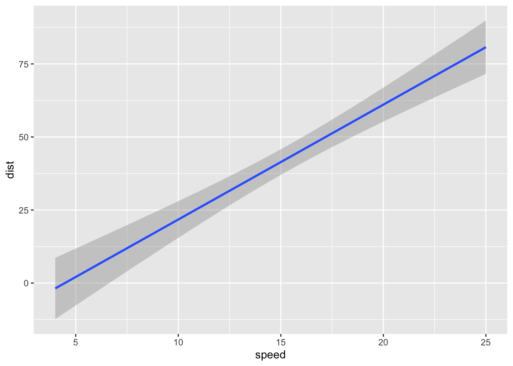

This is a paragraph in an [RMarkdown](https://rmarkdown.rstudio.com/) document.

#ggplot example


Below is a code chunk:


```r
library(tidyverse)

fit <- lm(dist ~ speed, data = cars)
b <- coef(fit)

ggplot(cars) +
  geom_smooth( aes( x = speed, 
                    y = dist ),
               method = lm)
```

```
## `geom_smooth()` using formula = 'y ~ x'
```



The slope of the regression is 3.9324088.


```python
x = 1
```

# Title

## Section X
This is my introduction.

## Quarterly Results {.tabset}
### By Product
(tab content)
### By Region
(tab content)


